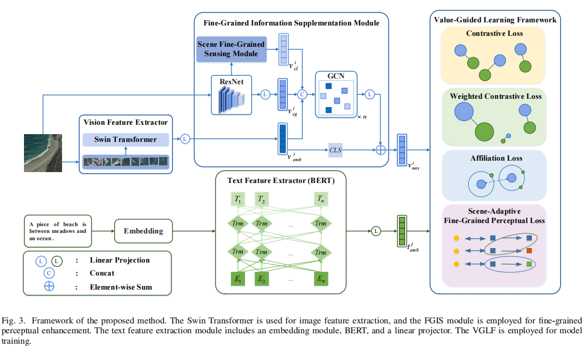
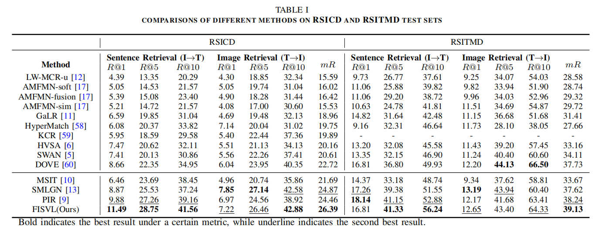
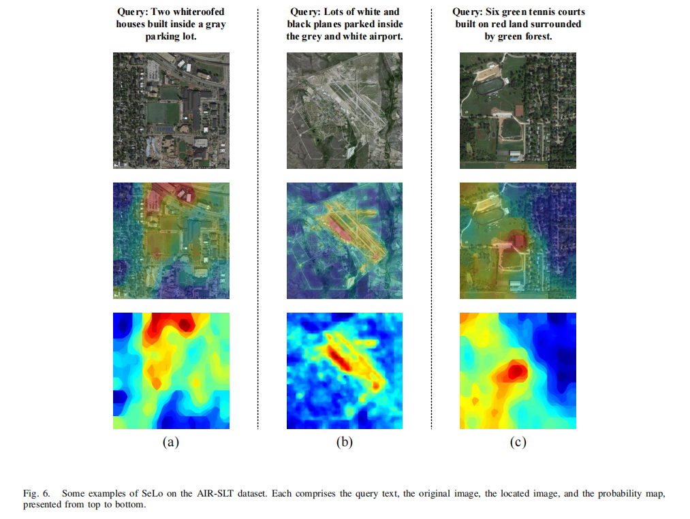

# About me

Hi, I am Zhou Zihui. I am a Master's student in Computer Science at Chongqing University 🎓. My current research interests include **Multi-modal Representation Learning**, **Vision-Language Models**, **Computer Vision**, and **Remote Sensing AI**.

- **Resume:** [Download Resume](assets/resume.pdf)
- **Zhihu:** [Profile](https://www.zhihu.com/people/guai-guai-28-38)

## Publications

**Assessment and Mitigation of Hallucinations in Multimodal Large Language Models within the Domain of Remote Sensing (Under Review)**

**Zihui Zhou**, Yong Feng, Guofan Duan, Mingliang Zhou, and Weijia Jia

- We characterize MLLM hallucination patterns in the remote sensing field, establishing a taxonomy that categorizes 4 different hallucination types.
- We propose an MLLM hallucinations detection suite: including **the RSHalluEval benchmark, evaluation metrics, and flexible automated hallucination detection strategies (for precision-focused and efficiency-focused scenes, respectively)**, and evaluate MLLM hallucinations in this domain.
- We introduce **RSHalluShield**: a hallucination mitigation dataset of 30,000 QA pairs.
- We fine-tune the model on the RSHalluShield dataset, resulting in a 12.33% increase in the hallucination-free rate. Superior performance is also achieved on downstream tasks.

**Fine-Grained Information Supplementation and Value-Guided Learning for Remote Sensing Image-Text Retrieval**

**Zihui Zhou**, Yong Feng, Agen Qiu, Guofan Duan, and Mingliang Zhou

**accepted by the IEEE Journal of Selected Topics in Applied Earth Observations and Remote Sensing** | [**Paper**](https://ieeexplore.ieee.org/stamp/stamp.jsp?arnumber=10716520) | [**Code**](https://github.com/zhouzihui2001/FISVL/tree/main)

We propose a fine-grained information supplementation and value-guided learning (FISVL) model. Feature enhancement is carried out by integrating the prior knowledge in the field of recommendation systems, and a value-oriented training strategy is adopted to learn feature representations that are fine-grained, highly expressive and robust. Specifically, FISVL contains the following core modules:
1. ​**fine-grained information supplementation (FGIS)​**: By fusing the visual information of global and local features, the perception ability of the model for multi-scale features of remote sensing images is enhanced, and the problem of representation limitations caused by insufficient feature granularity in traditional methods is solved.
2. ​**Double loss optimization mechanism**: Aiming at the problem of excessive similarity within the mode, weighted contrast loss (the weighting strategy refers to the dynamic adjustment method of sample importance) and scene adaptive fine-grained perceptial loss are proposed to improve the model discrimination ability by constraining the spatial distribution of features.
3. ​**Value-Guided Learning Framework**: enables the model to focus on the most valuable information at different training stages, thereby adapting to the specific requirements of each phase.
We verify the validity of the model on the RSICD and RSITMD datasets. The results show that this method reaches the leading level in both fine-grained feature learning and cross-modal alignment tasks.

## Educations

- _2023.09.01 - current_, Master's Student, Major in Computer Science, Chongqing University

  - Advisor: Prof. Feng Yong
  - Research Focus: **Multi-modal Representation Learning**, **Vision-Language Models**, **Computer Vision**, and **Remote Sensing AI**.

- _2019.09.01 - 2023.06.30_, Undergraduate Student, Major in Computer Science, Chongqing University

  - Bachelor Thesis: Research and Implementation of Image Text Retrieval Based on Attention Mechanism

## Projects
**Intelligent Environmental Monitoring System Based on Multi-source Satellite Remote Sensing Images**
- _September 2023-June 2024, **Chongqing University**, Project member
  -  Supervisor: Prof Feng Yong
  -  System functions:
    - Supports intelligent recognition of more than 13 types of objects in irregular environments such as forests and rivers.
    - Supports the segmentation of long and narrow rivers and can fit the trajectories on both sides of the river to calculate the trajectory fitting accuracy. The dynamic trajectory fitting accuracy is less than 4.78m.
    - Supports dynamic change detection and dynamic recognition of patches, with a dynamic recognition rate of patches exceeding 89.8%.
    - Supports the real-time interpretation of the large vision-language model.
  -  My contribute:
    - Developed a functional module for high-resolution remote sensing image segmentation, capable of segmenting objects of 13 categories in images of different sizes.
    - Deployed the remote sensing MLLM GeoChat to implement intelligent remote sensing question answering.

 ## Internships

- _December 2024-April 2025_, **Chongqing Longline Intelligent Technology Co., Ltd.** Perception and Localization Department Intern, Algorithm Design Engineer

  - **Automated Labeling for Autonomous Driving Data**: Responsible for business data adaptation and prompt design for model inference. The whole project has been packaged as an operator to enable large scale data production.
  - **Multi-modal Driving Data Generation**: Trained and optimized the 3D occupancy control generation model, including business data adaptation and model training and tuning for 3D scene reconstruction.
 
## Honors and Awards

- _November 2024_, University-level First-Class Scholarship
- _November 2023_, University-level First-Class Scholarship
- _October 2024_, University-level Merit Student
- _June 2022_, National-level Innovation and Entrepreneurship Training Program, Second-Level Completion

## Skills

### Programming Languages

- Python
- Java
- C++

### Machine Learning & AI

- **Frameworks**: PyTorch, OpenCV
- **Techniques**: Deep Learning, Multi-modal Representation Learning, Computer Vision

## 📧 Contact

- **Email:** 20191694@cqu.edu.com
